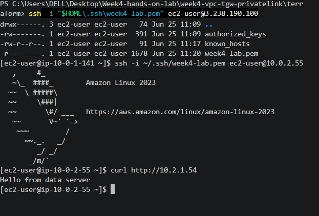

# Week 4 - AWS Transit Gateway and Multi-VPC Connectivity using Terraform

## Project Overview

This project demonstrates how to build a secure multi-VPC architecture on AWS using Terraform. The infrastructure consists of an App VPC and a Data VPC connected through an AWS Transit Gateway. A Bastion Host is used to securely access private EC2 instances.

The project validates private communication between VPCs without using public IP addresses.

---

## Architecture

```
                    Internet
                        |
                 Bastion Host (Public Subnet)
                        |
                        SSH
                        |
                 App Server (Private Subnet)
                        |
             AWS Transit Gateway (TGW)
                        |
                 Data Server (Private Subnet)
```

---

## Technologies Used

- AWS EC2
- AWS VPC
- AWS Transit Gateway
- AWS Security Groups
- AWS Route Tables
- Terraform
- Amazon Linux 2023
- SSH
- Python HTTP Server

---

## Infrastructure Created

### App VPC

- CIDR: `10.0.0.0/16`
- Public Subnet
- Private Subnet
- Internet Gateway
- Route Tables

### Data VPC

- CIDR: `10.2.0.0/16`
- Private Subnet
- Route Table

### Transit Gateway

- Connected App VPC
- Connected Data VPC
- Configured routing between both VPCs

### EC2 Instances

- Bastion Host (Public)
- App Server (Private)
- Data Server (Private)

---

## Security

### Bastion Security Group

- SSH (22) allowed only from my public IP

### App Server Security Group

- SSH allowed only from Bastion Security Group
- HTTP allowed within App VPC

### Data Server Security Group

- SSH allowed from App VPC
- HTTP allowed from App VPC

---

## Validation

Successfully verified:

- SSH from Local Machine → Bastion
- SSH from Bastion → App Server
- HTTP communication from App Server → Data Server through Transit Gateway

Command executed:

```bash
curl http://<DATA_SERVER_PRIVATE_IP>
```

Output:

```text
Hello from data server
```

This confirms successful private connectivity between both VPCs through AWS Transit Gateway.

---

## Project Structure

```
terraform/
│
├── main.tf
├── vpc.tf
├── tgw.tf
├── compute.tf
├── outputs.tf
├── terraform.tfvars (not committed)
└── .gitignore
```

---

## Screenshots

### Transit Gateway Attachments


---

### EC2 Instances


---

### Connectivity Validation



```bash
curl http://10.2.1.xx

Hello from data server
```

---

## Learning Outcomes

- Infrastructure as Code using Terraform
- Designing Multi-VPC Architecture
- AWS Transit Gateway Configuration
- Route Table Configuration
- Secure Bastion Host Architecture
- Security Group Design
- Private EC2 Communication
- SSH Troubleshooting
- Terraform State Management

---

## Cleanup

Destroy infrastructure after testing to avoid AWS charges.

```bash
terraform destroy
```

---

## Author

**Dinesh Patil**

DevOps Engineer

GitHub:
https://github.com/dinshpatil5615
